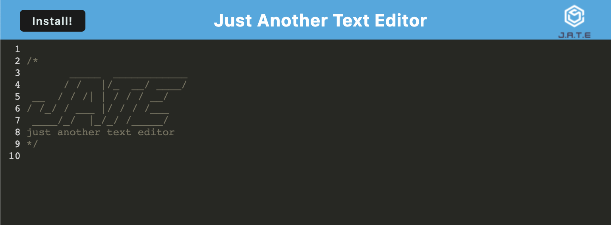

# PWA - Just Another Text Editor

## Description
  This is a basic Progressive Web App (PWA) in which users can type and edit text. It fulfills all the necessary requirements of a PWA, and data persists via localStorage and a database.

# Table of Contents

- [Installation](#installation)
- [Usage](#usage)
- [Screenshot](#screenshot)
- [Heroku](#heroku)
- [Credits](#credits)
- [Contributions](#contributions)

## Installation
  If you are running this application from your computer, navigate to the application within the terminal, run npm i to install the dependencies, and run npm start to open the application. Otherwise, simply visit the deployed app's url on heroku.

## Screenshot

## Heroku

The app is deployed to heroku below.

https://pwa-jate-bw.herokuapp.com/

## Credits
https://github.com/rudyxwhite

## Contact Information
  brandonrwing98@gmail.com
       
## Contributions
  No contributions allowed at this time.

  
